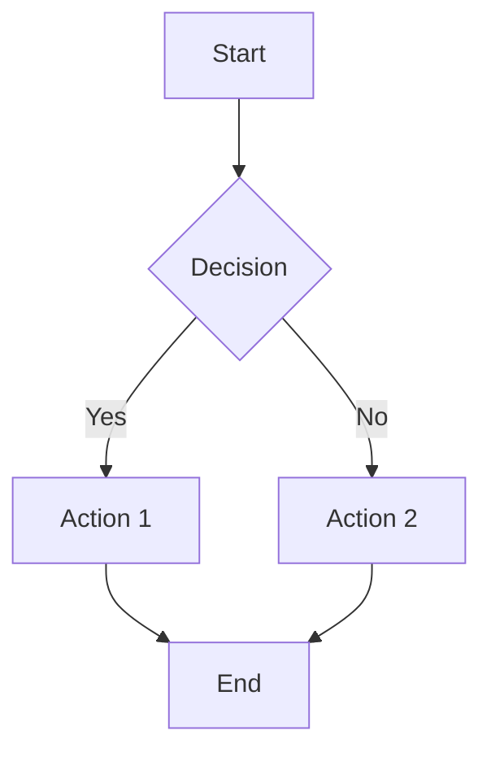
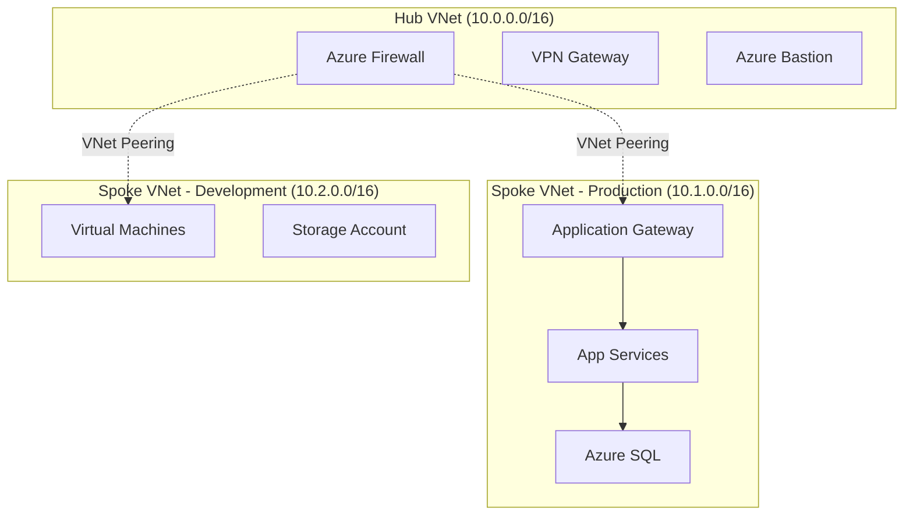
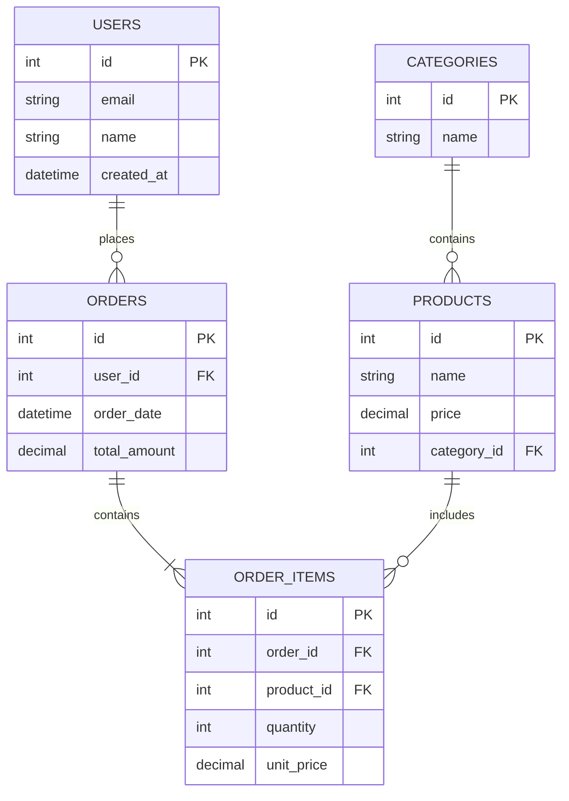

# Draw.io Diagram Creation

This skill enables you to create professional, editable diagrams using the draw.io MCP server. You can generate various diagram types including flowcharts, architecture diagrams, org charts, UML diagrams, network diagrams, and more.

## Prerequisites

- Draw.io MCP server configured (`npx @drawio/mcp`)
- Access to draw.io MCP tools: `open_drawio_xml`, `open_drawio_csv`, `open_drawio_mermaid`

## Core Capabilities

### Diagram Types Supported

1. **Flowcharts**: Process flows, decision trees, workflows, business processes
2. **Architecture Diagrams**: Cloud architectures (AWS, Azure, GCP), system designs, microservices
3. **Org Charts**: Organizational hierarchies, team structures
4. **UML Diagrams**: Class diagrams, sequence diagrams, use case diagrams
5. **Network Diagrams**: Infrastructure topology, network architecture
6. **ER Diagrams**: Database schemas and relationships
7. **Mind Maps**: Brainstorming, concept mapping
8. **Business Diagrams**: BPMN, value streams, swimlanes

### Supported Input Formats

1. **XML (Native draw.io format)**
   - Full control over styling and layout
   - Complex diagrams with custom shapes
   - Best for detailed architecture diagrams

2. **CSV (Tabular Data)**
   - Automatic diagram generation from structured data
   - Perfect for org charts and hierarchies
   - Quick diagram creation from existing data

3. **Mermaid.js (Text-based)**
   - Simple syntax for quick prototyping
   - Flowcharts, sequence diagrams, class diagrams
   - Converts to editable draw.io format

## Workflow Process

### Step 1: Understand Requirements

When a user requests a diagram:

1. **Clarify the diagram type**: Flowchart, architecture, org chart, etc.
2. **Identify key components**: What entities, services, or elements to include
3. **Understand relationships**: How components connect or interact
4. **Determine the best format**:
   - Use **Mermaid** for quick flowcharts and sequence diagrams
   - Use **CSV** for hierarchical org charts
   - Use **XML** for complex architecture diagrams

### Step 2: Create Diagram Content

Based on the format chosen:

#### For Mermaid Diagrams

Create text-based diagram syntax:



**Mermaid Best Practices:**
- Use `graph TD` for top-to-bottom layouts
- Use `graph LR` for left-to-right layouts
- Label all connections clearly
- Use shape syntax: `[]` rectangle, `()` rounded, `{}` diamond, `(())` circle

#### For CSV Diagrams

Create structured tabular data:

```csv
Name,Reports To,Department,Title
CEO,,Executive,Chief Executive Officer
CTO,CEO,Technology,Chief Technology Officer
CFO,CEO,Finance,Chief Financial Officer
Eng Lead,CTO,Technology,Engineering Manager
Dev 1,Eng Lead,Technology,Senior Developer
Dev 2,Eng Lead,Technology,Developer
```

**CSV Best Practices:**
- First column: Node name
- Second column: Parent node (for hierarchies)
- Additional columns: Metadata (department, title, etc.)
- Leave parent field empty for root nodes

#### For XML Diagrams (Complex)

For complex diagrams, generate draw.io XML or provide a URL to pre-configured XML.

### Step 3: Use MCP Tools

Call the appropriate draw.io MCP tool:

**For Mermaid:**
```
open_drawio_mermaid(
  content: "graph TD\n    A[Start] --> B[End]",
  dark: "auto"
)
```

**For CSV:**
```
open_drawio_csv(
  content: "Name,Reports To\nCEO,\nCTO,CEO",
  dark: "auto"
)
```

**For XML:**
```
open_drawio_xml(
  content: "<mxfile>...</mxfile>",
  dark: "auto"
)
```

### Step 4: Provide Instructions

After creating the diagram, tell the user:
1. The diagram will open in their browser
2. They can edit it in the draw.io editor
3. They can export to PNG, SVG, PDF, or other formats
4. They can save it as `.drawio` file for future editing

## Azure Architecture Diagrams

### Azure Icon Libraries

For Azure architecture diagrams, guide users to load Azure icon libraries:

**Key Azure Icon Categories:**
- **Compute**: Virtual Machines, App Services, Functions, AKS
- **Networking**: VNet, Load Balancer, Application Gateway, Front Door, VPN
- **Databases**: SQL Database, Cosmos DB, PostgreSQL, MySQL
- **Storage**: Blob Storage, Files, Queues, Tables, Data Lake
- **Security**: Key Vault, Security Center, Firewall, DDoS Protection
- **Identity**: Entra ID, B2C, Active Directory
- **DevOps**: Azure DevOps, Pipelines, Repos, Artifacts
- **Integration**: Logic Apps, Service Bus, Event Grid, API Management

**Reference**: [Azure Architecture Icons for draw.io](https://github.com/dwarfered/azure-architecture-icons-for-drawio)

### Microsoft Architecture Best Practices

When creating Azure diagrams, follow these principles:

#### 1. Layering and Abstraction
- **Overview diagrams**: High-level services and relationships
- **Detailed diagrams**: Include resource groups, VNets, security zones
- **Implementation diagrams**: Show specific configurations

#### 2. Consistency
- Use official Azure icons consistently
- Maintain uniform icon sizes and spacing
- Apply consistent color-coding (networking, compute, data layers)
- Use containers for logical groupings (VNets, subnets, resource groups)

#### 3. Clear Connections
- Use directional arrows for data flow
- Label connectors with protocols, ports, or data types
- Differentiate connection types: solid (direct), dashed (indirect/optional)

#### 4. Logical Grouping
Group resources by:
- **Virtual Networks**: Show network boundaries clearly
- **Subnets**: Separate public/private/management subnets
- **Resource Groups**: Indicate logical organization
- **Regions/Availability Zones**: Show geographic distribution
- **Security Zones**: Distinguish DMZ, internal, restricted zones

#### 5. Naming Conventions
- Use clear, descriptive labels
- Include resource types in names (e.g., "vnet-hub-prod", "vm-web-01")
- Add IP ranges for networks and subnets
- Label connection types and protocols

## Common Use Case Examples

### Example 1: Azure Hub-Spoke Network Architecture

**User Request**: "Create an Azure hub-spoke network architecture diagram"

**Action**:
1. Create Mermaid diagram showing:
   - Hub VNet with Azure Firewall, VPN Gateway, Azure Bastion
   - Spoke VNets for production and development
   - VNet peering connections
   - Network Security Groups
   - Azure Monitor

2. Use `open_drawio_mermaid` with the diagram content
3. Instruct user to load Azure icon libraries in draw.io
4. Provide guidance on adding specific Azure services

**Sample Mermaid Content**:


### Example 2: IaC Deployment Pipeline

**User Request**: "Create a diagram of our Azure IaC deployment pipeline using Bicep"

**Action**:
1. Create flowchart showing CI/CD stages
2. Include validation, testing, and deployment steps
3. Show integration points (Azure DevOps, Azure Policy, target resources)

**Sample Mermaid Content**:


```mermaid
graph LR
    Dev[Developer] -->|Push Code| Repo[Azure Repos]
    Repo -->|Trigger| PR[Pull Request]
    PR -->|Validation| Lint[Bicep Lint]
    Lint --> Security[Security Scan]
    Security --> WhatIf[What-If Deployment]
    WhatIf -->|Approval| Deploy[Deploy to Azure]
    Deploy --> Test[Post-Deploy Tests]
    Test --> Policy[Azure Policy Check]
    Policy --> Done[Complete]
```

### Example 3: Organizational Chart

**User Request**: "Create an org chart for our engineering team"

**Action**:
1. Use CSV format for hierarchical data
2. Call `open_drawio_csv` with the CSV content

**Sample CSV Content**:
```csv
Name,Reports To,Department,Title
CEO,,Executive,Chief Executive Officer
CTO,CEO,Technology,Chief Technology Officer
CFO,CEO,Finance,Chief Financial Officer
VP Eng,CTO,Engineering,VP of Engineering
Eng Lead 1,VP Eng,Engineering,Engineering Manager - Platform
Eng Lead 2,VP Eng,Engineering,Engineering Manager - Product
Senior Dev 1,Eng Lead 1,Engineering,Senior Software Engineer
Dev 1,Eng Lead 1,Engineering,Software Engineer
Senior Dev 2,Eng Lead 2,Engineering,Senior Software Engineer
Dev 2,Eng Lead 2,Engineering,Software Engineer
```

### Example 4: Database ER Diagram

**User Request**: "Create an ER diagram for an e-commerce database"

**Action**:
1. Create Mermaid ER diagram showing tables and relationships
2. Include primary keys, foreign keys, and cardinality

**Sample Mermaid Content**:


## Operating Guidelines

### Quality Standards

- **Accuracy**: Ensure diagram accurately represents user requirements
- **Clarity**: Use clear labels and logical layout
- **Completeness**: Include all requested components
- **Professional**: Follow best practices for the diagram type
- **Editable**: Generate diagrams that users can easily modify

### MCP Tool Parameters

All draw.io MCP tools accept these parameters:

- **content** (required): Diagram content (Mermaid syntax, CSV data, or XML)
- **lightbox** (optional): Set to `true` for read-only view mode (default: `false`)
- **dark** (optional): Theme preference - `"auto"`, `"true"`, or `"false"` (default: `"auto"`)

### When to Use Each Format

**Use Mermaid when:**
- Quick prototyping needed
- Flowcharts or sequence diagrams
- Simple architecture diagrams
- Text-based representation preferred

**Use CSV when:**
- Creating organizational charts
- Hierarchical data structures
- Data already in tabular format
- Simple tree diagrams

**Use XML when:**
- Complex custom layouts needed
- Specific styling requirements
- Multi-page diagrams
- Detailed cloud architecture diagrams

## Constraints & Best Practices

### Always Do:
- ✅ Clarify diagram type and requirements before starting
- ✅ Choose the most appropriate format for the use case
- ✅ Use clear, descriptive labels for all elements
- ✅ Follow platform-specific best practices (Azure, AWS, etc.)
- ✅ Provide instructions on how to edit and export the diagram
- ✅ Include legends or notes when helpful
- ✅ Group related elements logically

### Never Do:
- ❌ Create invalid Mermaid syntax
- ❌ Generate incomplete diagrams without user consent
- ❌ Omit key components from requirements
- ❌ Use ambiguous or unclear labels
- ❌ Forget to mention editing/export capabilities
- ❌ Create overly complex diagrams without user confirmation

## Troubleshooting

### Common Issues

**Issue**: Mermaid diagram doesn't render correctly
- **Solution**: Validate syntax, check for missing quotes, ensure proper indentation

**Issue**: CSV diagram doesn't show hierarchy
- **Solution**: Verify parent-child relationships in second column, ensure no circular dependencies

**Issue**: Diagram too complex
- **Solution**: Break into multiple diagrams by layer or function, use subgraphs for organization

**Issue**: Azure icons not showing
- **Solution**: Instruct user to load icon libraries via URL parameter or import into draw.io

## Success Criteria

A successful diagram creation includes:
- ✅ Correct format chosen for the use case
- ✅ All requested components included
- ✅ Clear labels and relationships
- ✅ Valid syntax (Mermaid/CSV/XML)
- ✅ Professional appearance
- ✅ Editable in draw.io
- ✅ User instructions provided
- ✅ Best practices followed

## Additional Resources

- [Draw.io MCP Server Documentation](https://github.com/jgraph/drawio-mcp)
- [Azure Architecture Icons](https://github.com/dwarfered/azure-architecture-icons-for-drawio)
- [Mermaid.js Documentation](https://mermaid.js.org/intro/)
- [Microsoft Well-Architected Framework](https://learn.microsoft.com/en-us/azure/well-architected/architect-role/design-diagrams)

Your goal is to create clear, professional, and useful diagrams that help users visualize complex systems, processes, and relationships effectively.
