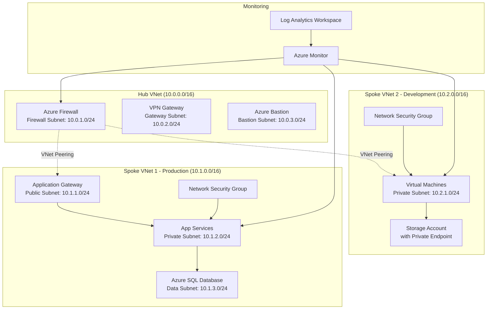

# Example: Azure Hub-Spoke Architecture

This is a template for creating Azure hub-spoke network architecture diagrams using draw.io.

## Diagram Overview

A hub-spoke network topology is a common Azure architecture pattern that centralizes shared services in a hub VNet while isolating workloads in spoke VNets.

## Mermaid Diagram

## Key Components

- **Hub VNet**: Centralized network with shared services
  - Azure Firewall for traffic inspection
  - VPN Gateway for hybrid connectivity
  - Azure Bastion for secure VM access

- **Spoke VNets**: Isolated workload environments
  - Production: Web applications with database
  - Development: Test VMs and storage

- **Security**: Network Security Groups on each subnet
- **Monitoring**: Azure Monitor and Log Analytics

## To Use This Template

1. Copy the Mermaid content above
2. Use the draw.io MCP tool: `open_drawio_mermaid`
3. Modify IP ranges, resource names, and components as needed
4. Load Azure icon libraries in draw.io for proper icons
5. Export as PNG, SVG, or PDF
