# Example: CI/CD Pipeline Flowchart

This is a template for creating CI/CD pipeline diagrams using draw.io.

## Diagram Overview

A typical CI/CD pipeline showing the flow from code commit to production deployment with automated testing and approvals.

## Mermaid Diagram

```mermaid
graph LR
    Dev[Developer] -->|Commits Code| Git[Git Repository]
    Git -->|Webhook Trigger| CI[CI Pipeline Start]

    CI --> Checkout[Checkout Code]
    Checkout --> Build[Build Application]
    Build --> UnitTest[Run Unit Tests]

    UnitTest -->|Success| IntTest[Integration Tests]
    UnitTest -->|Failure| Notify1[Notify Team]

    IntTest -->|Success| Security[Security Scan]
    IntTest -->|Failure| Notify1

    Security -->|Success| Artifact[Create Artifact]
    Security -->|Failure| Notify1

    Artifact --> DeployDev[Deploy to Dev]
    DeployDev --> SmokeTest[Smoke Tests]

    SmokeTest -->|Success| DeployStaging[Deploy to Staging]
    SmokeTest -->|Failure| Notify1

    DeployStaging --> E2ETest[E2E Tests]
    E2ETest -->|Success| Approval{Manual Approval}
    E2ETest -->|Failure| Notify1

    Approval -->|Approved| DeployProd[Deploy to Production]
    Approval -->|Rejected| Notify1

    DeployProd --> Verify[Verify Deployment]
    Verify -->|Success| Complete[Pipeline Complete]
    Verify -->|Failure| Rollback[Rollback]

    Complete --> Notify2[Success Notification]
    Rollback --> Notify1

    style Dev fill:#e1f5ff
    style Complete fill:#90ee90
    style Notify1 fill:#ffcccb
    style Notify2 fill:#90ee90
```

## Pipeline Stages

1. **Source Control**: Code commit triggers pipeline
2. **Build**: Compile and build application
3. **Test**: Run automated tests
   - Unit tests
   - Integration tests
   - Security scanning
4. **Package**: Create deployable artifact
5. **Deploy**: Progressive deployment
   - Development environment
   - Staging environment
   - Production (with approval)
6. **Verify**: Post-deployment validation
7. **Notify**: Alert team of results

## To Use This Template

1. Copy the Mermaid content above
2. Use the draw.io MCP tool: `open_drawio_mermaid`
3. Customize stages based on your pipeline
4. Add or remove testing stages as needed
5. Modify environment names and approval gates
6. Export the final diagram
